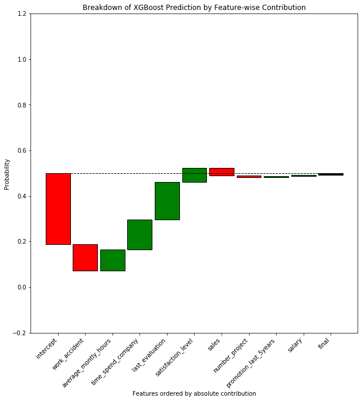

# xgb-explainer-vis
Function to visualize the XGBoost explainer in Python.

The XGBoost explainer in Python is cloned from: https://github.com/gameofdimension/xgboost_explainer and combined with my plotting code.

# Usage

```python
# import
import xgboost as xgb
from xgboost_visualizer import *

# train a XGBoost model using xgb.train() rather than the sklearn equivalent interface.
xgb_trained = xgb.train(dtrain, ...)

# get a feature list for the variables used in the model training
features = [...]

# get a sample
sample = xgb.DMatrix(...)

# plot contribution
plot_contribution(xgb_trained, sample, features)
```

The output plot will look like the following:


